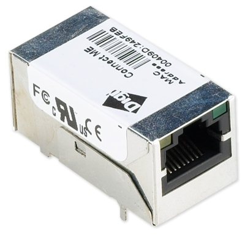
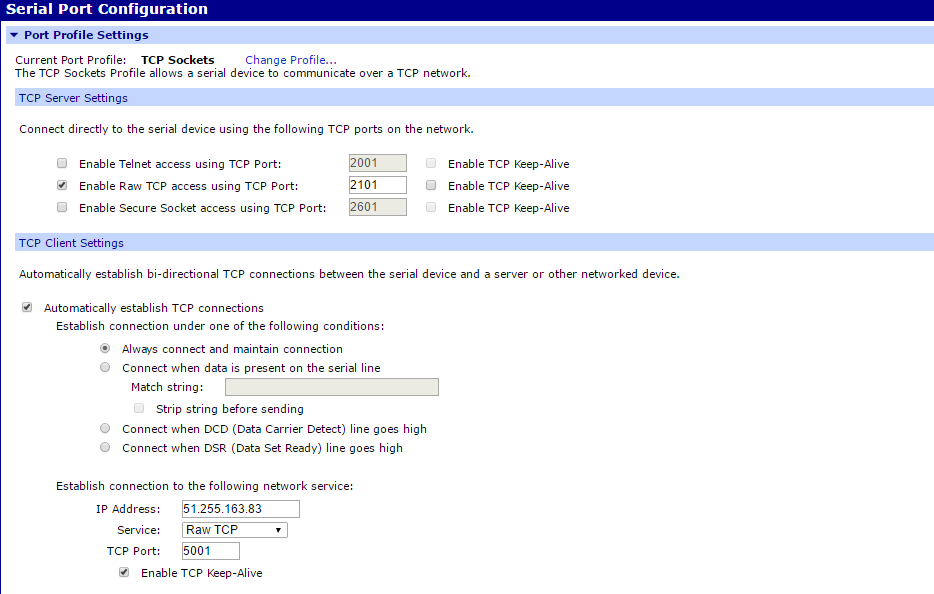
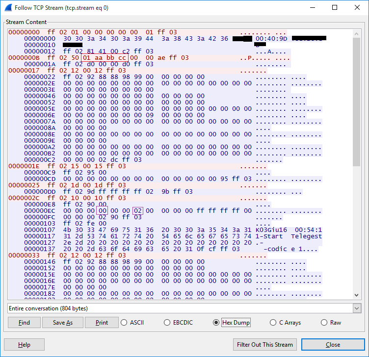
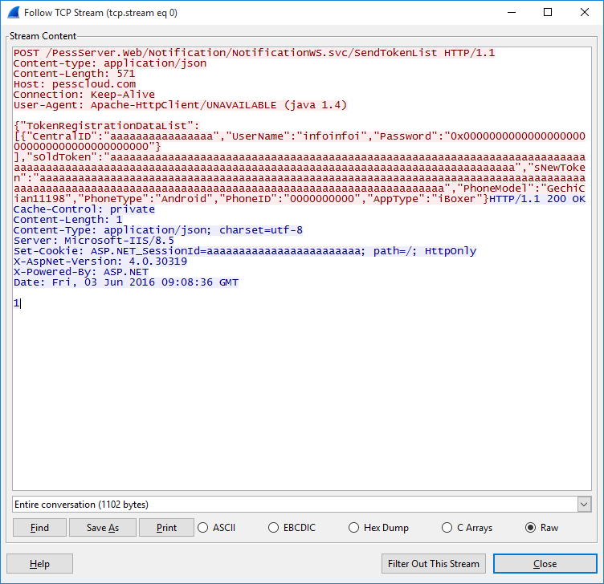
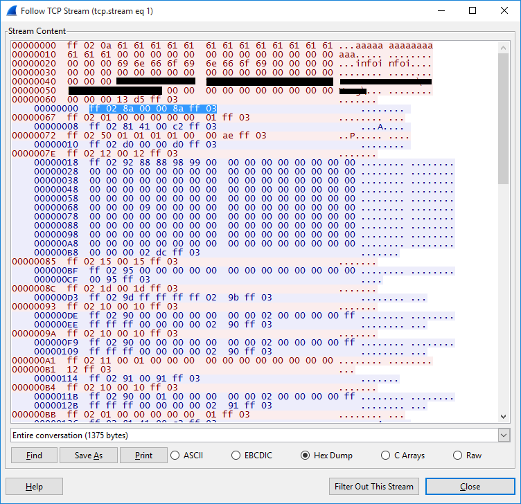

# Antifurto Pess iBoxer - Sicurezza Informatica

(http://plinioseniore.github.io/pess-antifurto)

## In breve
Ho passato qualche ora a giocare con la sicurezza informatica del nuovo antifurto installato in casa, i-Boxer prodotto da Pess Technology, questo repository contiene le catture dati con le interazioni tra antifurto e applicazione utente, mostrando come si possano recuperare le credenziali di accesso.

> Le informazioni fornite di seguito hanno un puro scopo indicativo con l'obiettivo di sensibilizzare l'importanza della sicurezza informatica dei prodotti connessi ad Internet.

*Il file di cattura è stato modificato per nascondere le informazioni sensibili, come la password.*

### Il modulo Digi Connect ME

La centralina utilizza un protocollo binario bidirezionale basato su RS232 ed un modulo Digi Connect ME per incapsulare il protocollo RS232 su una socket TCP.



Le credenziali di accesso al modulo erano quelle di default, utilizzando **root** e **dbps** si può accedere al pannello di configurazione del modulo Digi Connect ME



Il modulo apre una connessione verso *pesscloud.com* all'indirizzo 51.255.163.83, se questa connessione non è attiva si mette in ascolto sulla porta 2101. Questi dati sono in genere disponibili anche sul manuale utente e non è strettamente necessario accedere al modulo Digi Connect ME.

### Password gestite in chiaro

Con un semplice *Man in The Middle* è possibile recuperare l'intera sessione di comunicazione tra l'applicazione e la centralina, in cui c'è evidenza della password in chiaro (nel rettangolo rosso).



Non c'è un meccanismo in due passaggi che permetterebbe di trasmettere i dati in chiaro senza poter essere riutilizzati, quindi basta intercettare il traffico e riprodurre la sequenza di scambio per accedere alla centralina.

Nel rettangolo blu alla riga 0x0EC è indicato se l'allarme è disattivato (0x00) o attivato (valore diverso da 0x00) e nel rettangolo viola se ci sono finestre aperte (0x00 per finestre chiuse). Nel caso dell'esempio l'antifurto era disattivato e le finestre aperte.

### Il sistema cloud

Il server *pesscloud.com* di fatto rigira solo il flusso dati dalla porta RS232 della centralina verso il cellullare connesso anche se fuori dalla rete locale, qualsiasi interazione fatta in locale può essere effettuata in remoto. Anche in questo caso, con un *Man in The Middle* è possibile recuperare tutti i dati di accesso, per poter poi accedere al sistema antifurto da remoto.




## Un potenziale attacco automatizzato

Come prerequisito la rete locale su cui è stato installato l'antifurto deve esser stata violata o in altenativa un PC sulla stessa rete deve esser stato violato, in questo modo è possibile effettuare un furto dei dati di accesso con i seguenti passi:

1. Identificare l'eventuale presenza di un antifurto Pess i-Boxer
2. Effettuare un MITM
3. Attendere un accesso da parte del proprietario del sistema

### Identificare l'eventuale presenza di un antifurto Pess i-Boxer

L'individuazione è semplice, ed è composta dai seguenti passi

1. Effettuare uno scan dei dispositivi collegati sulla rete, individuando i MAC address della Digiboard (00:40:9D:xx:xx:xx)
2. Dirottare il traffico del dispositivo Digiboard per analizzarlo (MITM)
3. Verificare se c'è traffico dati verso l'indirizzo IP del server *pesscloud.com*

Se il punto 3 è verificato, si tratta di un antifurto Pess connesso al cloud. Se non viene riscontrata una connessione verso *pesscould.com* si può effettuare uno scan delle porte TCP aperte sul dispositivo, con particolare enfasi su 2101 ed inviare la sequenza esadecimale 

```FF 02 01 00 00 00 00 00 01 FF 03```

Se la risposta conterrà ```FF 02 81 41 00 C2 FF 03``` , il punto 3 è verificato. Queste stringhe non sembrano essere legate al numero di serie della centralina. 

A questo punto non resta che attendere una connessione valida, in modo che saranno disponibili tutte le credenziali di accesso. Di conseguenza sarà possibile monitorare lo stato dell'antifurto, disattivarlo da remoto e forzarne le uscite (ad esempio facendo suonare le sirene anche in assenza di una reale intrusione).

## Possibili utilizzi e rischi per l'utente

Nella pratica, probabilmente il rischio principale non è per l'utente ma per l'azienda produttrice. Violare il sistema Pess i-Boxer richiede conoscenze informatiche nella media, ma non è possibile con la sola violazione della centralina individuare l'indirizzo d'installazione.

E' invece tutto sommato semplice poter realizzare dei malware che forzino comportamenti inattesi, come l'attivazione o la disattivazione dell'antifurto o l'attivazione delle sirene senza motivo apparente, questo minerebbe la credibilità dell'utenza verso il sistema di antifurto.

